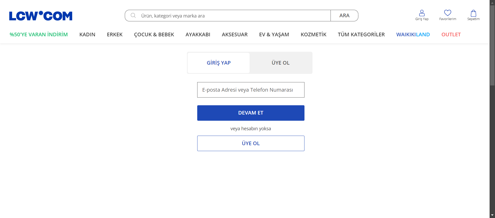
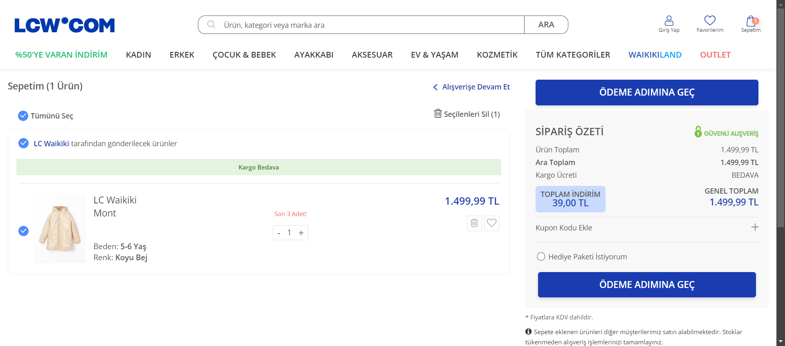
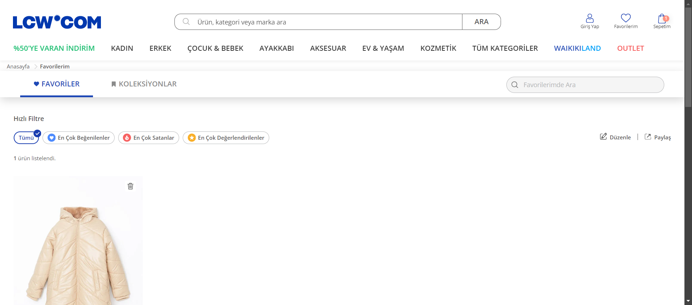

# LC Waikiki Bootcamp Project

This project is the graduation project of the Patika-LC Waikiki Software Testing Bootcamp and involves testing the LC Waikiki website using Selenium.

## Table of Contents

- [Technologies Used](#technologies-used)
- [Test Plan](#test-plan)
- [Installation](#installation)
- [Running the Project](#running-the-project)
- [Project Dependencies](#project-dependencies)
- [Explanation](#explanation)
- [App Images](#app-images)

## Technologies Used

- **Java** – The programming language used for test automation.  
- **Selenium** – A testing tool for automating web applications.  
- **TestNG** – A testing framework for managing and executing test cases.  
- **Maven** – A build automation tool for managing project dependencies and running tests.   
- **Allure Reports** – A reporting tool that visualizes test results in detail.  
- **Extent Reports** – A framework for generating detailed test execution reports.  
- **Log4j2** – A logging library for managing logs and debugging test processes.  
- **Apache JMeter** – A testing tool for performance and load testing.
 
 
## Test Plan

The test plan for the LC Waikiki Bootcamp graduation project is provided in the following Google Doc: [LC Waikiki Bootcamp Graduation Project Test Plan.](https://docs.google.com/document/d/1pkD5oo1-eWxtkA5KHPXAMZXISXXrZ9VVhs6z1Cpl4OA/edit?usp=sharing)


## Installation 

### Prerequisites

Ensure you have the following software installed on your machine:

   **Java JDK** :
   - Download and install from [Oracle's official website](https://www.oracle.com/tr/java/technologies/downloads/) 
   
   **IDE (Integrated Development Environment)**:
   -  Use [IntelliJ IDEA](https://www.jetbrains.com/idea/download/?section=windows), [Eclipse](https://www.eclipse.org/downloads/), or other IDEs to organize and run tests.

   **Git** – For cloning the repository:
   - Install Git from [Git's official website](https://git-scm.com/) if it's not already installed.

   **Allure Command Line** (Optional for report generation):
   - Install Allure by following the instructions on [Allure's GitHub page](https://github.com/allure-framework/allure2).


### Project Setup & Execution

Clone the Project Repository:

 ```bash
git clone https://github.com/hsyncnblk/SoftwareTestFinalCase.git
```

Navigate to the Project Directory

 ```bash
cd SoftwareTestFinalCase
```

Open the Project in Your IDE

Open IntelliJ IDEA, click on Open, and navigate to the cloned project directory (SoftwareTestFinalCase). Select the folder and open it.

Install Project Dependencies
 ```bash
mvn clean install
 ```

 you can choose and run any specific test file from the **test** folder based on your needs. Simply select the test file you want to execute and run it using your IDE's run options.

 Generate Reports 
 ```bash
 allure serve allure-results
```


## Explanation:

- **allure-results**: Directory where Allure test reports are generated.
- **ExtentReports/ExtentReportResults.html**: The HTML file containing the Extent Report of the test execution.
- **jmatter-result**: Directory for storing JMeter performance testing results.

- **src/main/java/pages**:
  - **BasePage.java**: This is an abstract class that reduces code duplication for common page functionalities.
  - Each page class in this folder contains its own specific locators and methods related to the page.

- **src/main/java/utils**:
  - **Log.java**: Utility class for logging test execution details.
  - **ScreenshotHelper.java**: Utility class for capturing screenshots during tests.
  - **WebDriverFactory.java**: Factory class that initializes and provides WebDriver instances.

- **src/test/java/tests**:
  - **BaseTest.java**: Base class that contains common test setup and teardown methods that can be extended by individual test classes.
  - Contains various test classes for testing the application.

- **src/test/java/utils/ExtentReports**:
  - **ExtentManager.java**: Manages the configuration and setup of Extent Reports.
  - **ExtentTestManager.java**: Manages the individual test execution logs in Extent Reports.

- **src/test/java/utils/Listener**:
  - **TestListeners.java**: Contains custom listeners used for test execution, such as capturing screenshots when a test fails.

- **src/test/resources**:
  - **screenshots**: Directory where all the screenshots taken during test execution will be stored.
  - **log4j2.xml**: Configuration file for Log4j2 to manage logging during test execution.


- **pom.xml**: The Maven configuration file that manages all the project dependencies.

This structure helps maintain a clean, scalable, and organized test automation framework.


## App Images


Below are the screenshots of different pages tested in this project:

### 🏠 Home Page


### 🔐 Login Page


### 🔍 Filter Page


### 📄 Detail Page


### 🛒 Cart Page


### ❤️ Favorite Page



